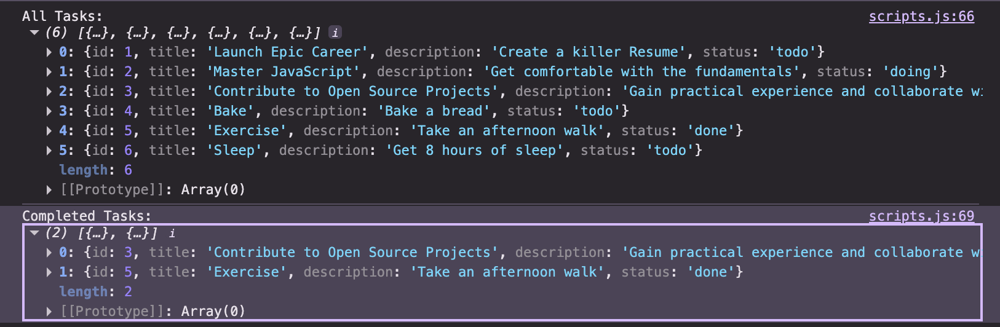

## 🕹️Console-Based Task Manager🕹️

## 💡 Overview

This project involves creating a **simple task management system** where users can add **up to three new tasks** to an existing task array. Tasks are **stored as objects in an array**, each with a **unique incremental ID**. Users will enter task details via prompts, and the system will allow filtering to view only completed tasks. The project focuses on **array manipulation, user interaction via prompts and alerts, and console logging for task management**.

---

## 🚀 Key Objectives

### 🧠 Logic & User Interaction

- Store all tasks as **objects within an array** to maintain organized and structured data.  
- Enable users to **add up to three new tasks** to the existing list.  
- Automatically assign each new task a **unique, incremental ID** based on the previous task’s ID.  
- Prompt users to input **task details** — including _title_, _description_, and _status_ — which are then stored as object properties.  
- Display an alert when the task limit is reached:  
  _"There are enough tasks on your board, please check them in the console."_  
- Implement a **filter function** that displays only tasks with the status `"done"`.  
- Log **all tasks** to the console under a clear label for easy reference.  
- Log **completed tasks only** (status: `"done"`) under a dedicated `"Completed Tasks"` label for quick review.  

---

## ⛏️ Tech Stack

---

## 🎯 Expected Outcome

A **simple yet structured task management system** that allows users to efficiently **add, review, and filter tasks** while maintaining a clear focus on **code readability, documentation, and long-term maintainability**.

**Console Log of all and completed tasks**

